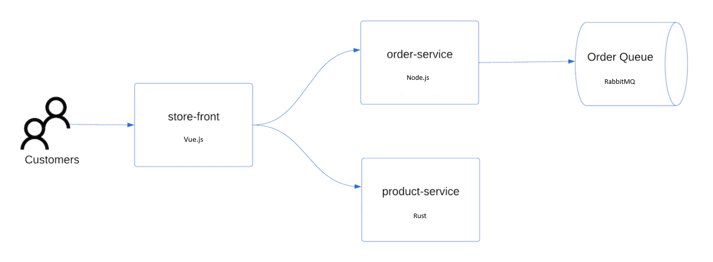

# Azure AKS Cluster CLI Deployment

This repository provides a step-by-step guide to deploy an Azure Kubernetes Service (AKS) cluster using Azure CLI, along with a microservices application.

## Prerequisites

- Azure CLI
- kubectl
- Azure account with necessary permissions

## Setup

1. Install Azure CLI:

```
curl -sL https://aka.ms/InstallAzureCLIDeb | sudo bash
```
2. Verify installation:
```
azure version
```
3. Login to Azure:
```
vagrant@cloud-native-box:~/azure-aks-cluster-cli-deployment$ az version
{
  "azure-cli": "2.62.0",
  "azure-cli-core": "2.62.0",
  "azure-cli-telemetry": "1.1.0",
  "extensions": {}
}
vagrant@cloud-native-box:~/azure-aks-cluster-cli-deployment$ 
```

### Install specific version

```
apt-cache policy azure-cli
```

### Login via cli
```
az login
```

- Output

```
Retrieving tenants and subscriptions for the selection...

[Tenant and subscription selection]

No     Subscription name    Subscription ID                       Tenant
-----  -------------------  ------------------------------------  -----------------
[1] *  Azure for Students   001c48e4-c931-4ce3-a98c-cae948d3d885  Default Directory

The default is marked with an *; the default tenant is 'Default Directory' and subscription is 'Azure for Students' (001c48e4-c931-4ce3-a98c-cae948d3d885).

Select a subscription and tenant (Type a number or Enter for no changes): 
```

4. Create AKS cluster:
### Preparation script  for create AKS

```
sh create-aks.sh

```
5. Verify node creation:
### Confirm Node

```
kubectl get nodes -o wide
```

- Output

```
Merged "akhDemoAKSCluster" as current context in /home/vagrant/.kube/config
NAME                                STATUS   ROLES   AGE   VERSION    INTERNAL-IP   EXTERNAL-IP   OS-IMAGE             KERNEL-VERSION      CONTAINER-RUNTIME
aks-nodepool1-34171807-vmss000000   Ready    agent   65s   v1.28.10   10.224.0.4    <none>        Ubuntu 22.04.4 LTS   5.15.0-1067-azure   containerd://1.7.15-1
Kubernetes control plane is running at https://akhdemoaks-akhdemoaksresour-001c48-qzyg2750.hcp.japaneast.azmk8s.io:443
CoreDNS is running at https://akhdemoaks-akhdemoaksresour-001c48-qzyg2750.hcp.japaneast.azmk8s.io:443/api/v1/namespaces/kube-system/services/kube-dns:dns/proxy
Metrics-server is running at https://akhdemoaks-akhdemoaksresour-001c48-qzyg2750.hcp.japaneast.azmk8s.io:443/api/v1/namespaces/kube-system/services/https:metrics-server:/proxy

```


```
vagrant@cloud-native-box:~/azure-aks-cluster-cli-deployment$ kubectl get node -o wide
NAME                                STATUS   ROLES   AGE    VERSION    INTERNAL-IP   EXTERNAL-IP   OS-IMAGE             KERNEL-VERSION      CONTAINER-RUNTIME
aks-nodepool1-34171807-vmss000000   Ready    agent   108s   v1.28.10   10.224.0.4    <none>        Ubuntu 22.04.4 LTS   5.15.0-1067-azure   containerd://1.7.15-1
vagrant@cloud-native-box:~/azure-aks-cluster-cli-deployment$ 
```


### Microservices Overview




1. **Store Frontend**
    - **Deployment**: `store-front-deploy.yaml`
    - **Service**: `store-front-svc.yaml`
    - **Description**: Frontend application that interacts with the backend services (orders, products) via their respective services.
2. **Orders Service**
    - **Deployment**: `order-deploy.yaml`
    - **Service**: `order-svc.yaml`
    - **Description**: Manages orders, connects to RabbitMQ for messaging.
3. **Product Service**
    - **Deployment**: `product-deploy.yaml`
    - **Service**: `product-svc.yaml`
    - **Description**: Handles product-related operations.
4. **RabbitMQ**
    - **Config**: `rabbitmq-config.yaml`
    - **Deployment**: `rabbitmq-deploy.yaml`
    - **Service**: `rabbitmq-svc.yaml`
    - **Description**: Acts as a message broker for communication between services.


### tree output

```
vagrant@cloud-native-box:~/azure-aks-cluster-cli-deployment/resources$ tree
.
├── order-deploy.yaml
├── order-svc.yaml
├── product-deploy.yaml
├── product-svc.yaml
├── rabbitmq-config.yaml
├── rabbitmq-deploy.yaml
├── rabbitmq-svc.yaml
├── store-front-deploy.yaml
└── store-front-svc.yaml

0 directories, 9 files
```

### Deploy to each file

```bash
vagrant@cloud-native-box:~/azure-aks-cluster-cli-deployment/resources$ kubectl apply -f order-deploy.yaml
deployment.apps/order-service created
vagrant@cloud-native-box:~/azure-aks-cluster-cli-deployment/resources$ kubectl apply -f order-svc.yaml
service/order-service created
vagrant@cloud-native-box:~/azure-aks-cluster-cli-deployment/resources$ kubectl apply -f product-svc.yaml
service/product-service created
vagrant@cloud-native-box:~/azure-aks-cluster-cli-deployment/resources$ kubectl apply -f product-deploy.yaml
deployment.apps/product-service created
vagrant@cloud-native-box:~/azure-aks-cluster-cli-deployment/resources$ kubectl apply -f rabbitmq-config.yaml
configmap/rabbitmq-enabled-plugins created
vagrant@cloud-native-box:~/azure-aks-cluster-cli-deployment/resources$ kubectl apply -f rabbitmq-deploy.yaml
deployment.apps/rabbitmq created
vagrant@cloud-native-box:~/azure-aks-cluster-cli-deployment/resources$ kubectl apply -f rabbitmq-svc.yaml
service/rabbitmq created
vagrant@cloud-native-box:~/azure-aks-cluster-cli-deployment/resources$ kubectl apply -f store-front-deploy.yaml
deployment.apps/store-front created
vagrant@cloud-native-box:~/azure-aks-cluster-cli-deployment/resources$ kubectl apply -f store-front-svc.yaml
service/store-front created
vagrant@cloud-native-box:~/azure-aks-cluster-cli-deployment/resources$ 
```

### Confirm every resource that we deploy

```bash

vagrant@cloud-native-box:~/azure-aks-cluster-cli-deployment/resources$ kubectl get svc,deploy,pod,configmap
NAME                      TYPE           CLUSTER-IP     EXTERNAL-IP      PORT(S)              AGE
service/kubernetes        ClusterIP      10.0.0.1       <none>           443/TCP              21m
service/order-service     ClusterIP      10.0.16.200    <none>           3000/TCP             102s
service/product-service   ClusterIP      10.0.89.238    <none>           3002/TCP             94s
service/rabbitmq          ClusterIP      10.0.76.8      <none>           5672/TCP,15672/TCP   62s
service/store-front       LoadBalancer   10.0.143.124   48.218.127.134   80:32360/TCP         45s

NAME                              READY   UP-TO-DATE   AVAILABLE   AGE
deployment.apps/order-service     1/1     1            1           115s
deployment.apps/product-service   1/1     1            1           86s
deployment.apps/rabbitmq          1/1     1            1           71s
deployment.apps/store-front       1/1     1            1           55s

NAME                                   READY   STATUS    RESTARTS   AGE
pod/order-service-76d7f5b8f5-v8snj     1/1     Running   0          115s
pod/product-service-7566c548bd-wdr27   1/1     Running   0          86s
pod/rabbitmq-6ddd848578-dhp5r          1/1     Running   0          71s
pod/store-front-7cc6c7bb67-gmqzq       1/1     Running   0          55s

NAME                                 DATA   AGE
configmap/kube-root-ca.crt           1      20m
configmap/rabbitmq-enabled-plugins   1      78s

```

### Confirm with curl store-front service that we use LoadBalancer


```bash
vagrant@cloud-native-box:~/azure-aks-cluster-cli-deployment/resources$ curl 48.218.127.134 
<!doctype html><html lang=""><head><meta charset="utf-8"><meta http-equiv="X-UA-Compatible" content="IE=edge"><meta name="viewport" content="width=device-width,initial-scale=1"><link rel="icon" href="/favicon.ico"><title>store-front</title><script defer="defer" src="/js/chunk-vendors.df69ae47.js"></script><script defer="defer" src="/js/app.06c08c33.js"></script><link href="/css/app.0f9f08e7.css" rel="stylesheet"></head><body><noscript><strong>We're sorry but store-front doesn't work properly without JavaScript enabled. Please enable it to continue.</strong></noscript><div id="app"></div></body></html>vagrant@cloud-native-box:~/azure-aks-cluster-cli-deployment/resources$ 

```

### Confirm from browser 


Happy Learning ...!!!